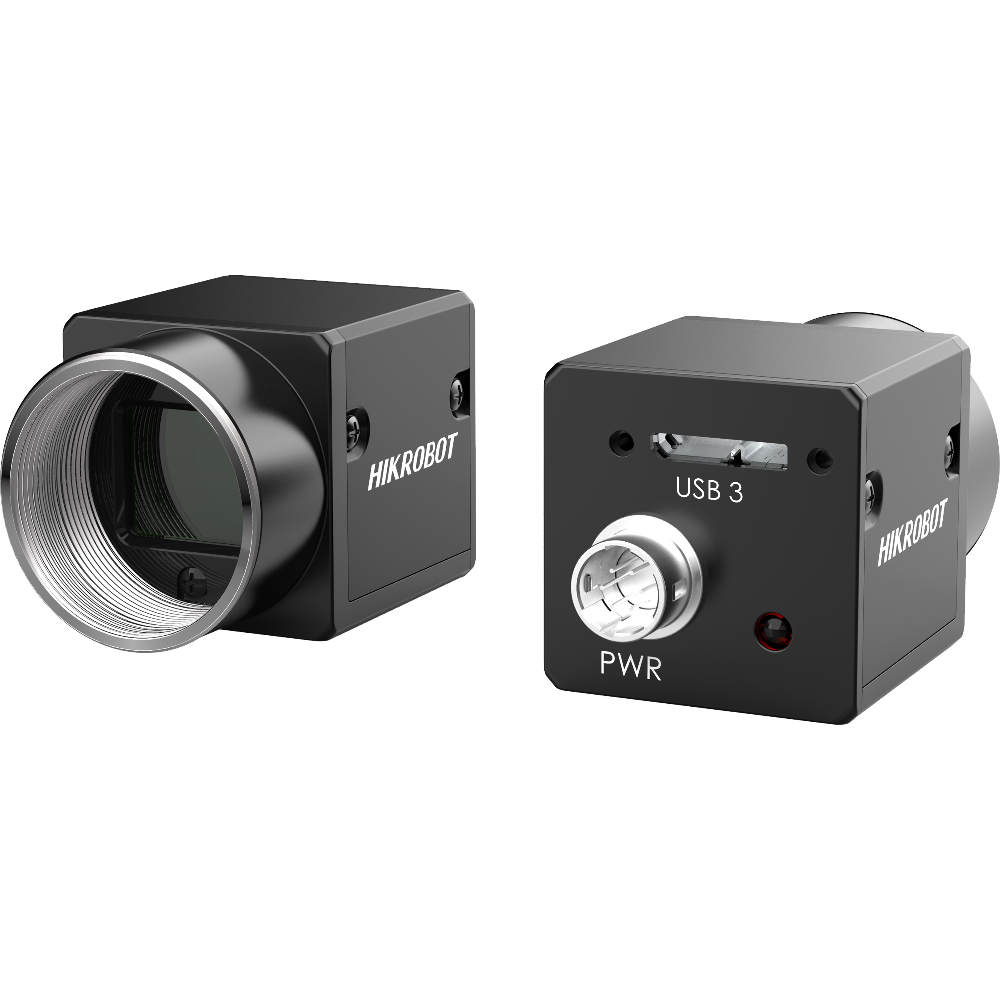

# SweeperAudit

Totally, there are four critical module in this sweeper audit system. Dependence Package (Include hardware of camera, 4G module, jetson processor and GPS), Trash segmentation model (Dataset label, Training and Applying), Application module, and Center Portal Command center (GUI and Database)

**If you want to master the whole SweeperAudit system from training model to running the whole real-time audit system, you need follow the all topics in the following part.**

## **Run Project**
- [ ] Ensure you have configured all the environment on the Jetson xavier (or any other device with ubuntu 20.04). Refer to [Dependence Package](environment_configuration/dependence_package/README.md) 
- [ ] Ensure the driver of the camera and GPS is correctly installed. Refer to [Configuration in Jetson](environment_configuration/dependence_package/jetson_environment/install_in_jetson/README.md)
- [ ] Ensure your mobile device correctly connect to the command center. (Both of the command center and the mobile device are connected in the same local area network) Refer to [Command Center](environment_configuration/command_center/README.md)
- [ ] Ensure the model checkpoint is trained and put at the suitable folder. Refer to [Model Training](environment_configuration/sweeper_audit_model/README.md)
### Use script to run
+ ``` sh jetson.sh ```
+ You can add the script to the systemmd to run the script after every reboot.
+   ``` 
    sudo cp sweeper.service /etc/systemd/system/sweeper.service
    sudo chmod 644 /etc/systemd/system/sweeper.service
    sudo systemctl start sweeper
    sudo systemctl status sweeper
    sudo systemctl enable sweeper
    ```

## Other necessary component
### Command_center
Command center is a server to manage the recorded data (location, datetime, unclean level and other things of each vehicles) from the sweeper vehicles and it will generate some report to summary one day's result.
About the command center, you can refer to [Command Center README](environment_configuration/command_center/README.md) to see all the details.

### Dependence_Package
Help you from zero to build the environment of Sweeper Audit System. Refer to the README in jetson_environment
[Dependence Installation README](environment_configuration/dependence_package/README.md)
Now there are two parts:
+ **Jetson pack installation** and running  


+ **Hikrobot Industrial Camera** We use this camera to catch the road images for detection. So we need to install the SDK and driver in order to run the main system.



### Sweeper audit model training and testing (segmentation)
#### Label new data for the dataset
If you want to get your own road datasets and you have some collected raw images. First you need to use labelme to label these data to get the json file.
Refer to the README in raw_data_preprocess
[Label new data README](environment_configuration/raw_data_preprocess/README.md)

#### Data preprocess to make the label data trainable
Then Refer to the README to preprocess the json file to trainable labeled images, the method  [Preprocess README](environment_configuration/sweeper_audit_model/README.md)

#### Data Training and testing
Train the model with DIY datasets. With the new datasets build by data preprocess, we train the model with neural network and record the checkpoint
[Train data README](environment_configuration/sweeper_audit_model/README.md)

