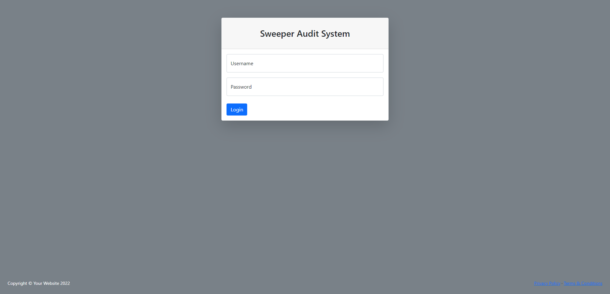
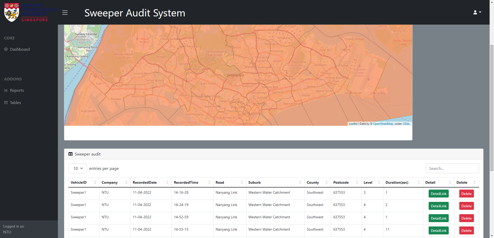

## Back to the title [Title README](./../../README.md)

## Command Center

Command center include two parts: Backend Software  Database and Frontend GUI Bootstrap

### MySQL
+ install MySQL [MySQL](https://dev.mysql.com/downloads/windows/installer/8.0.html)
+ [Install instruction](https://www.digitalocean.com/community/tutorials/how-to-install-mysql-on-ubuntu-20-04)
+ Log in Mysql in windows cmd
+ ``` mysql -u root -p ```
+ change password ```ALTER user 'root'@'localhost' IDENTIFIED WITH mysql_native_password BY '123'; ```

### SSH transimission
+ [OpenSSH](https://ld246.com/article/1598698273711)
+ To use ssh to transmission your file to the windows server
    + Examine whether the windows system has installed the openssh
    + Open Powershell with Administor
    + Command ``` Get-WindowsCapability -Online | ? Name -like 'OpenSSH*' ```
    + If the command say not installed
        ```
        Name:OpenSSH.Client~~~~0.0.1.0
        State:NotPresent
        Name:OpenSSH.Server~~~~0.0.1.0
        State:NotPresent
        ```
    + Then install the openssh.client and openssh.server
        ```
        Add-WindowsCapability -Online -Name OpenSSH.Client~~~~0.0.1.0
        Add-WindowsCapability -Online -Name OpenSSH.Server~~~~0.0.1.0
        ```
    
    + Finally start the ssh service
        ```
        Start-Service sshd
        Set-Service -Name sshd -StartupType 'Automatic'
    + And you can ssh or sftp to the windows server use ``` ssh name@ip ```


### Django and Bootstrap
+ install Django ```pip install Django==3.2```
+ Then enter a command on the command line to let Django know that our custom model has some changes, and generate a script to create a data table based on the model of our custom app
```
cd command_center/sweeper_command_center
python manage.py makemigrations home
python manage.py migrate home
```
+ Run the command to start the Django server
```
python manage.py runserver 0.0.0.0:8000
```
+ Open http://$your_ipaddress:8000 in browser


+ Enter Username:ntu, Password:ntu and enter into the index page
