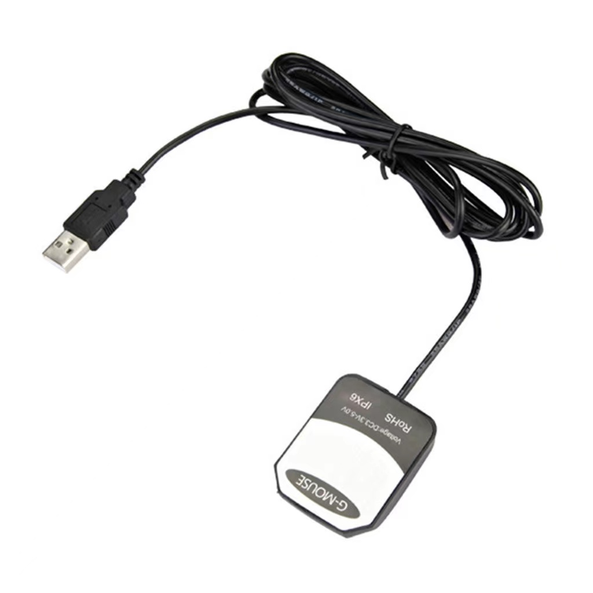

## Back to the title [Title README](./../../README.md)

## Dependence Package Installation Instruction
This Document will teach you how to build the environment of the package. From build the Jetpack to flash the developer kit to install ros, camera driver.

### First installation: Jetpack

### Second installation: Install necessary package into jetson
**After configuring all the fundamental environment in your jetson (CUDA, Computer Vision, etc) by the first step of Jetpack installation [Jetpack Installation](../README.md), we need to install additional environment (ROS, Camera Driver).**
+ First you need to change the computer 'login in' authority.
    + First we need to stop ubuntu from asking password when sudo
    	+ ``` sudo vim -w /etc/sudoers ```
    	+ then use the editor to change the sudo authority
    	+ substitude ```sudo ALL=(ALL:ALL) ALL``` to ```sudo ALL=(ALL:ALL) NOPASSWD:ALL```
    	+ save the file
    + Power on -> Login your account -> Linux Bar -> Settings -> Users
    + Unlock to change settings 
    + 
    + Choose 'Automatic Login'
+ Initial the environment
    + Connect to the internet
    + Copy the father folder 'install_in_jetson'[install_in_jetson](./) into the Jetson.
+ Install ros noetic
    + cd folder 'install_in_jetson'[install_in_jetson](./)
    + ``` sh envconfig_ros.sh ``` in Jetson (It includes ROS Master installation, Hikrobot camera Initialization)
    + ```roscore``` to examine whether the installation has finished
+ Install camera SDK and driver into Jetson
    + cd folder 'install_in_jetson'[install_in_jetson](./)
    + ``` sh envconfig_camsdk.sh ``` in Jetson (Initalize the Hikrobot Camera and python package requirement)
    + examine the SDK has been installed (if worked, means successful): 
    ```
    cd /opt/MVS/bin
    sh MVS.sh
    ```
+ Install pytorch to run the algorithm
    + cd folder 'install_in_jetson'[install_in_jetson](./) 
    + ``` sh envconfig_pytorch.sh ``` 
+ Install mysql and pymysql
    + install MySQL [MySQL](https://dev.mysql.com/downloads/windows/installer/8.0.html) on Jetson (not need to use the sql, but only need the base to connect the mysql on the center portal)
    + [Install instruction](https://www.runoob.com/mysql/mysql-install.html)
    + Log in Mysql in windows cmd
    + ``` mysql -u root -p ```
    + change password ```ALTER user 'root'@'localhost' IDENTIFIED WITH mysql_native_password BY '123'; ```
    
+ GPS
  + **VK-162 G-Mouse USB GPS Receiver** We use this GPS to get the location of the vehicle. A port file '/dev/ttyACM0' will be generated after we plug the GPS on the SDK. We give the user right to read and write the port by: 
    
    sudo chmod 777 /dev/ttyACM0 (Finished in clean_monitoring.sh file)
  + Then we need install driver "nmea-navast-driver"to read the longtitude and latitude through the port continuously: 

    sudo apt install ros-noetic-nmea-navsat-driver (Finshed in envconfig_camsdk.sh file)

    rosrun nmea_navsat_driver nmea_serial_driver _port:=/dev/ttyACM0 _baud:=9600 (Finished in clean_monitoring.sh file)
  + After that, we utilize Geopy model to transfer location to address so that the address of dirty road part can be recorded. 
  + 