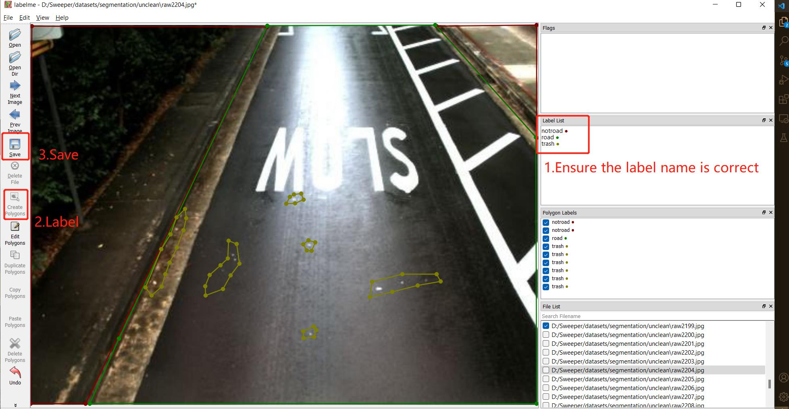

## Back to the title [Title README](./../../README.md)

## Install Labelme to label new images
First Step: If you want to add some labeled data to the dataset, you should follow these steps
+ use labelme to label (**To be stable, it is need to install the 5.0.1 version**) ``` pip install labelme==5.0.1 ```
+ ``` labelme ```
+ 'Open Dir' to choose the dir of your image, '->File->change output dir' to change the output dir of your json file
+ label the data and save the result as json file
  + There are some tips
  1. You need to label the unroad and road part first, then label the trash part.


+ After labeling, we get the json files. We need to change something and get the available datasets with available name.
  + ``` replace your_python_path/Lib/site-packages/labelme/cli with ./json_to_dataset.py ```
  + ``` python3 ./image_preprocess.py ```
  + The image file and label file is generated in the folder ``` ../Sweeper_Audit_Model/dataset/sweeper/ ```  
