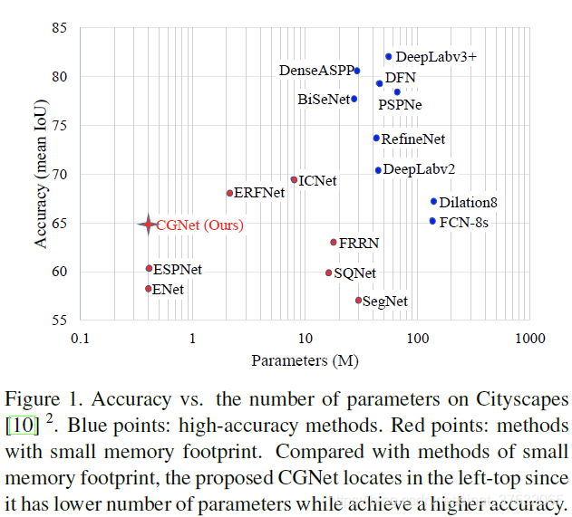

### Semantic segmentation
+ 语义分割各个模型的准确率和参数量的纵横图(cityscape)
+ 

# 10.17
## learn the structure of HRNet + OCR

## learn how to use mmsegmentation

# 10.18 
## ERFNet
+ Just encoder with decoder

## Segformer
+ https://zhuanlan.zhihu.com/p/379054782
  + encoder: 减少transformer在encoder的运算量
  + decoder: 仅用了MLP作为decoder, 大大减少了运算量 （据说是因为transformer增大了感受野
+ Transformer 中的positional encoding
  + https://zhuanlan.zhihu.com/p/166244505

# 10.19
## How transformer works and what kind of situation it works

# 11.1
## Segformer
+ Unlike ViT that can only generate a single-resolution feature map, the goal of this module is, given an input image, to generate CNN-like multi-level features.
  + 与只能生成单分辨率特征图的ViT不同，该模块的目标是，给定一个输入图像，生成类似cnn的多级特征。