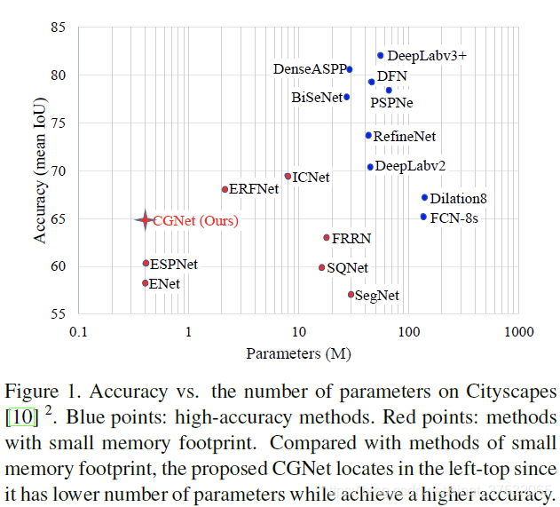

### Semantic segmentation
+ 语义分割各个模型的准确率和参数量的纵横图(cityscape)
+ 

# 2022.9.22
## Segmentation Transformer: Object-Contextual Representations for Semantic Segmentation
+ Semantic segmentation is a problem of assigning one label li to each pixel pi of an image I, where li is one of K different classes.
+ 语义分割是给图像I的每个像素pi分配一个标签li的问题，其中li是K个不同类中的一个

## 全卷积网络FCN Fully Convolutional Networks for Semantic Segmentation
+ https://zhuanlan.zhihu.com/p/30195134

## 语义分割之MIoU原理与实现
+ https://www.jianshu.com/p/42939bf83b8a
# 10.17
## learn the structure of HRNet + OCR

## learn how to use mmsegmentation

# 10.18 
## ERFNet
+ Just encoder with decoder

## Segformer
+ https://zhuanlan.zhihu.com/p/379054782
  + encoder: 减少transformer在encoder的运算量
  + decoder: 仅用了MLP作为decoder, 大大减少了运算量 （据说是因为transformer增大了感受野
+ Transformer 中的positional encoding
  + https://zhuanlan.zhihu.com/p/166244505

# 10.19
## How transformer works and what kind of situation it works

# 2022.10.12
## 更直观的理解就是，Encoder负责将一张图片的每个像素点，通过复杂的计算过程，映射到某一个高维分布上，而Decoder则是负责将这个高维分布，映射到给定的类别区域。中间的高维分布，是我们不可见的，但神经网络却可以很好的使用它。正是这种借助中间的高维分布的思想，搭建起来了原图像到像素级分类图像的桥梁，实现了end-to-end的训练过程。

## ERFNet https://blog.csdn.net/baidu_23388287/article/details/102911321
### 1.开始先减少图片的size，减少冗余，并使用残差block来减小网络尺寸
### 模型沿用了Encoder-Decoder的结构
+ non_bottleneck 借鉴了resblock
  + ```         output = self.conv3x1_1(input)
        output = F.relu(output)
        output = self.conv1x3_1(output)
        output = self.bn1(output)
        output = F.relu(output)

        output = self.conv3x1_2(output)
        output = F.relu(output)
        output = self.conv1x3_2(output)
        output = self.bn2(output)

        if (self.dropout.p != 0):
            output = self.dropout(output)
        return F.relu(output+input)
    ```
## HRNet
+ https://github.com/HRNet/HRNet-Semantic-Segmentation/tree/HRNet-OCR?v=2
+ paper: https://arxiv.org/pdf/1909.11065v6.pdf

# 11.1/11.10
## Segformer
+ Unlike ViT that can only generate a single-resolution feature map, the goal of this module is, given an input image, to generate CNN-like multi-level features.
  + 与只能生成单分辨率特征图的ViT不同，该模块的目标是，给定一个输入图像，生成类似cnn的多级特征。
### Read the code
#### Some unknown functions

#### self.patch_embed1(x) -------> OverlapPatchEmbed()
```
        x, H, W = self.patch_embed1(x)
```
+ What, Why, How is OverlapPatchEmbed()
  + what: 迭代生成四个层级的特征
  + why: ?????? 
  + how: 将特征大小缩小一半

